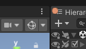
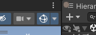
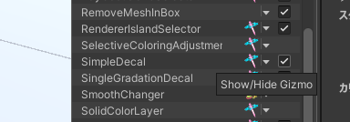
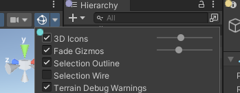
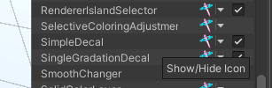
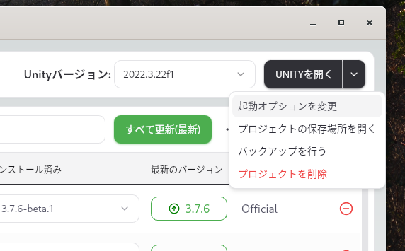
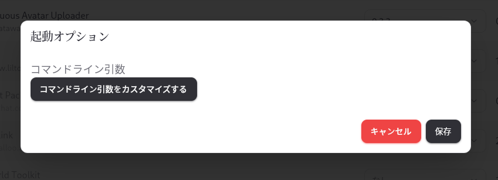
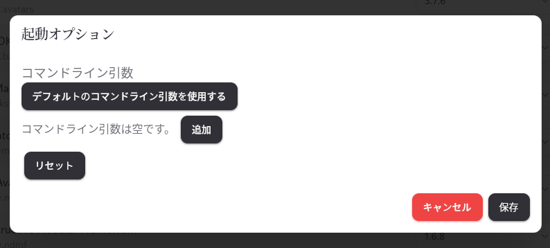
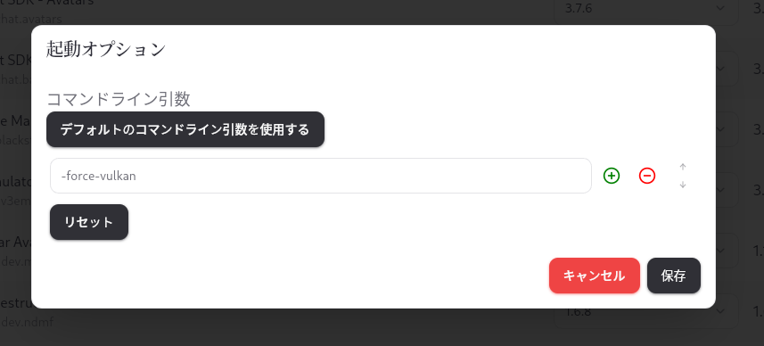

# FAQ

## バグの報告や困った時

この FAQ や リファレンス を参考にしても解決できなかったときやバグ報告等は

- [NDMF Discord](https://discord.gg/dV4cVpewmM)
- [GitHub](https://github.com/ReinaS-64892/TexTransTool)
- Reina_Sakiria [ActivityPub](https://misskey.niri.la/@ReinaS_64892) or [X](https://x.com/ReinaS_64892)

などにお尋ねください！

## アップロードしたアバターに効果が反映されないまたは壊れる

主にプレビューでは正常に動作するが、VRChatにアップロードしたアバターにはプレビューのような結果にならない状態。

この場合 Material置き換えアニメーションが存在しないか確認してください！
TexTransTool はマテリアル置き換え等のアニメーション系の影響を一切考慮しません！

- SimpleDecal などのデカール系やテクスチャ編集系は マテリアル置き換えによってもともともマテリアルに戻されてしまい、それに伴いすべて元のテクスチャになります。
- AtlasTexture は UV の変更及びメッシュの置き換えは残ったまま、マテリアルだけもともとの物に戻されてしまい、UVの参照位置の違いによりテクスチャ等が破綻した状態になります。

これらの解決策はマテリアルアニメーションを行わないことで可能なので削除してください！

## アップロード時やEditorの再生時、マニュアルベイク時に適用されない

TexTransTool のコンポーネントは基本的に、ビルド時に Active でないと動作しません。

そして、プロジェクトに TexTransTool が対応している [NDMF](https://github.com/bdunderscore/ndmf) が導入されているかもご確認ください！

特に、 TexTransTool のプレリリース版を使用している場合、[NDMF](https://github.com/bdunderscore/ndmf) もプレリリース版を使用する必要がある場合があります！

[NDMF](https://github.com/bdunderscore/ndmf) のインストールの仕方は [MAのドキュメント](https://modular-avatar.nadena.dev/ja/docs/intro#%E3%83%86%E3%82%B9%E3%83%88%E7%89%88)を参考にしてください！

## ギズモが表示されない

[SimpleDecal](/docs/Reference/SimpleDecal) や [SingleGradationDecal](/docs/Reference/SingleGradationDecal)、[IslandSelector](/docs/Reference/IslandSelector) など、 TexTransTool のコンポーネントは 選択時 に ギズモ を表示することがありますが、それらが表示されない事があります。

表示されない原因の一つとして、SceneView 右上の ギズモ表示のトグルが無効化されていることです。  
下記画像のようになっていると表示されません！  

クリックして、この画像のように青くすると表示されます。  

それでも表示されない場合は、稀ですが ギズモ表示のトグル右のドロップダウンから、コンポーネント個別で Gizmo の表示がオフになっている場合もあるのでご注意ください！  

## アイコンが邪魔

TexTransTool に限らず、ツールのコンポーネントが SceneView に表示するアイコンが邪魔な場合があります。

ギズモ表示のトグル右のドロップダウン から `3D Icons` を小さくしたり無効化したりして、表示を目立たせなくすることも可能です。  

完全に非表示にしたい場合はそのドロップダウンからアイコンの部分をクリックすることで、一つ一つ個別に無効化することも可能です。

少し上級者向けですが、特定のツールのアイコンを一気に非表示にしたい場合は[このスクリプト](https://gist.github.com/ReinaS-64892/ea5162bec70ab23404b4b0b4d9033726)を用いることで可能です。

## TTT を使用したアセットが動かない

そのアセットが古い TexTransTool のバージョンで作られた可能性があります。

もしそうであれば、バックアップを取った後に[Migrator](/docs/Reference/EditorWindow/Migrator.md)を開き、マイグレーションを実行してみてください！

## GTX10XX や GTX9XX 系の環境で正しく TTT が動作しない

TTT v0.9.x の既知のバグとして、GTX10XX や GTX9XX などの GPU を使用している環境で、UnityEditor が DirectX11 を使用している場合、以下のものは確実に正常動作しません。

- SimpleDecal
- SingeGradationDecal
- TTT PSD Importer

それらが正しく動作しないことが確認されている GPU にはこれらが存在します。[参考](https://github.com/ReinaS-64892/TexTransTool/issues/903)

- GTX 1080
- GTX 1070TI
- GTX 1070
- GTX 1060
- GTX 980

次期バージョンである TTT v0.10.0 にて[修正](https://github.com/ReinaS-64892/TexTransTool/issues/904)を予定していますが、一時的な回避策として Vulkan を使用することで回避できます。

### UnityEditor を Vulkan で起動する

:::warning
上級者向けの設定を使用します！設定するときは細心の注意を払ってください！
:::

はじめに、 [ALCOM](https://vrc-get.anatawa12.com/ja/alcom/) をなければインストールしてください。VCC では設定することができません！

次に、プロジェクトの `管理` を開き `起動オプションを変更` をクリックしてください。  

そうしたら、このような画面が表示されるので、`コマンドライン引数をカスタマイズする` をクリック。  

新たに表示される `追加` ボタンを使用し  

`-force-vulkan` を追加し、`保存` すれば、次回起動時から UnityEditor が Vulkan を使用して起動するようになります！  

:::tip
`デフォルトのコマンドライン引数を使用する` を使用するとデフォルト設定の戻すことができ、 Vulkan を使用して起動する設定を消すことができます。
:::

## VMware にて TTT が動作しない

確認された環境(`VMware(R) Workstation 17 Pro 17.6.2 build-24409262`)では、2つの RenderTexture の間で値をコピーするだけである `NotBlend` Blending すら動作しません。
VMware の Driver との相性が非常に悪いのか VMware の ComputeShader 実装は TTT の使用に耐えられるものではないようです。

根本的な解決方法は見つかりませんでした。他の TTT の使用に耐えられる ComputeShader 実装を持つ環境に変えてください。

## TexTransCore って何？

[github repository](https://github.com/ReinaS-64892/TexTransCore)

これは、TexTransTool の C# Generic な部分の存在で、下記 TTCE-Wgpu のためにバージョン管理の都合で切り離された存在、TexTransTool は TexTransCore なしでは動作できない、TexTransTool 唯一の依存パッケージになります。

## TTCE-Wgpu って何？

[github repository](https://github.com/ReinaS-64892/TTCE-Wgpu)

これは TexTransCore にある ComputeShader の抽象化レイヤー実装で、当然 Unity の  API を使って その抽象化レイヤーの実装が TexTransTool には存在するため、通常必要のない存在です。

TexTransTool の資産のライフタイムを Unity とバインドしないため、そして、私のメイン環境が Linux に移動した都合で Vulkan をゴリ押しで使うため、他に手段がないゆえに実用化された存在です。
