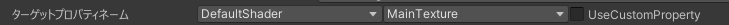
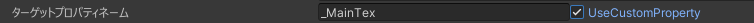

# TargetPropertyName

日本語表記 : ターゲットプロパティネーム

TexTransTool においてマテリアルのプロパティを指定するときに使われる存在です。  
よくマテリアルのプロパティを介してテクスチャを指定するために使われます。

Unityのドキュメントであればこのあたりの物を指しています。
[Unity Documentation](https://docs.unity3d.com/ja/current/Manual/SL-Properties.html)

## 設定項目

### シェーダーセレクター

シェーダーを選択する項目です。

:::info
現状 lilToon 以外のシェーダーは存在しませんが、追加できるようにしたいとは考えていて、いずれ任意に追加できる機能が実装される可能性があります。
:::

### プロパティセレクター

上記で選択されたシェーダーの持つ、UV0 を参照していることの多いプロパティをドロップダウンで選べる項目

### カスタムプロパティ

  
この項目を有効化すると上記2つの項目が無効化され、任意の文字で指定することが可能になります

:::tip
シェーダーからその `PropertyName` を調べてくれば、いかなるシェーダーのプロパティを選択することが可能になります。
:::
