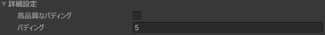

# SimpleDecal

## 概要

テクスチャを平行に投影したかのように見えるテクスチャを生成し、元のテクスチャと合成することでテクスチャ改変を行う  
[AtlasTexture](/docs/Reference/AtlasTexture)の為に作られた UVtoUV の技術を転用して作られたコンポーネント。

## 属性

- フェーズ -> [AfterUVModification | UV変更後](/docs/Reference/General/ExecutionOrder.md#afteruvmodification--uv変更後)
- Can be used [AsLayer](/docs/Reference/MultiLayerImageCanvas/AsLayer.md)

## デカールが張られる基準

- 適切なレンダラーが1つ以上指定されていること [詳細](#レンダラー設定)
- ギズモの範囲にポリゴンが存在すること [詳細](#カリング設定)
- 対象となるレンダラーが持つマテリアルに [ターゲットプロパティネーム](#ターゲットプロパティネーム)で指定されるテクスチャーが存在すること

## 設定項目

### レンダラー設定

対象とする `レンダラー` (`SkinnedMeshRenderer` or `MeshRenderer`) を指定するための項目。

`レンダラー選択モード` にて、二種類の選択方法が使用できます。

#### レンダラー選択モード-`Auto`

アバターに存在する有効な`レンダラー`すべてを対象とする選択モードです。

`Auto` 単体の設定では、意図しないレンダラーも対象になってしまうため、下記 [`マテリアルでフィルタリング`](#マテリアルでフィルタリング) などの使用を推奨します。

##### マテリアルでフィルタリング

有効にしたとき、アバター内に存在するマテリアルが一覧表示され、チェックを入れたマテリアルを持った`レンダラー`だけが選択されるようになります。

:::info
この項目が有効な場合、その選択されたマテリアルにだけデカールができようされるようになる効果もあります。

つまり、複数スロットを持ち、一つだけ選択されたマテリアルを持っていた場合は、その選択されたマテリアルにだけに対してデカールが張られるようになります。
:::

###### 自動選択時にフィルタリングするマテリアル

主に `PrefabOverride` を解決するために表示されている項目です。

プレハブで管理している場合にご使用ください。

###### 適用時に非アクティブなレンダラーを含める

適用時に`レンダラー`が無効化されていたとしても、レンダラーを含めることが可能になる項目です。

意図しない`レンダラー`も選択されてしまう可能性もあるため取り扱い注意。

:::tip
[`アイランド選択`](#アイランド選択) を用いて、対象範囲を絞るのも非常に有用です。
:::

#### レンダラー選択モード-`Manual`

旧来の SimpleDecal のデフォルト状態と同じ、手動で`レンダラー`をリストに入れることで選択するモードです。

その`レンダラー`の有効無効等は完全に無視され、指定されたものすべてを選択します。

##### ターゲットレンダラー

旧来の SimpleDecal の `マルチレンダラーモード` と全く同じリストが表示され、任意の`レンダラー`を割り当てることが可能です。

:::info
旧来の SimpleDecal に存在した、`シングルレンダラーモード` は廃止されました。  
リストに一つだけ`レンダラー`を入れることで同様のことが可能です。
:::

### テクスチャー設定

#### デカールテクスチャー

張り付けるテクスチャーそのもの、貼り付けたいテクスチャーをここに割り当ててください。

ここに割り当てたテクスチャーのアスペクト比は [スケール設定](#スケール設定) に影響します。

#### カラー

[デカールテクスチャー](#デカールテクスチャー)に乗算し、貼り付けるデカールの色をその場で変更する設定です。

:::info
数値をそのまま乗算するだけであり、ペイントツールの合成モードの乗算とは異なるなる挙動をします。
:::
:::tip
デカールテクスチャーが存在しない場合は、カラーの色がそのままデカールテクスチャーになります。単色のデカールを張りたいときに便利です。
:::

#### ブレンドタイプキー

デカールを元のテクスチャと合成するとき、どのような色合成でデカールを合成するかを指定できます。

[詳細はこちら](/docs/Reference/Common/BlendTypeKey)

#### ターゲットプロパティネーム

`レンダラー`が持つ`マテリアル`のどのプロパティが持っている物にデカールを貼り付けるかに影響する設定です。

`メインテクスチャー`(`_MainTex`)以外(例えば `エミッションテクスチャー` など)にデカールを貼り付けたい場合に使用します。

[詳細はこちら](/docs/Reference/Common/TargetPropertyName)

### スケール設定

#### スケール

その `GameObject` に存在する `Transform` の `ローカルスケール` の `X` ([アスペクト比固定](#アスペクト比固定) が有効な場合隣に `Y` ) の値が表示され、デカールを張る 横幅(と縦幅)に対応します。

:::warning
`Transform` のスケールを直接操作することでも同様のことが可能ですが、[アスペクト比固定](#アスペクト比固定) が有効な場合、ここの値を変更した瞬間 `Y` の値が上書きされます。
:::

#### アスペクト比固定

有効だと画像のアスペクト比に応じて 縦幅 の値を自動設定します。

アスペクト非固定無効化したUI  

#### 最大距離

ローカルスケールの Z の値で、デカールが張られる大体の奥行きと対応しています。

### カリング設定

#### サイドカリング

有効な場合デカールの方向から見て裏面となるポリゴンにはデカールが張られなくなります。

:::info
スケールの一部がマイナスになっているとデカールする方向から見て表面に張られなくなることがあります。
:::

#### アイランド選択

[アイランドセレクター](/docs/Reference/IslandSelector)を用いて、デカールの描画範囲をアイランド単位でマスクすることができます。

### 詳細設定

#### 高品質なパディング

通常パディングはディザのようなジャギが発生することがあります。

それを処理時間と引き換えに、ジャギが発生しない高品質な生成をするオプションです。
必要になるケースも非常に少なく、高負荷でアバターのビルド時間の増加を招くので必要がなければ使用しないことを推奨します。

:::info
プレビュー(NDMF Preview等)では、動作しないことがあります。
:::

#### パディング

`MipMap` でにじまないようにするために、ある程度デカールを広めに塗る機能です。

特に必要がない限り変更する必要はない設定です。

:::warning
この `パディング` の値を非常に大きな値にした場合に、 デカールの描画が壊れたり、意図しない場所にデカールの色が塗られることがあります。
:::

### 実験的機能

:::warning
これらは実験的機能で予告なく削除や変更が行われる可能性があります。
:::

#### OverrideDecalTextureWithMultiLayerImageCanvas

[MultiLayerImageCanvas](/docs/Reference/MultiLayerImageCanvas) の内容をそのまま [デカールテクスチャー](#デカールテクスチャー) として使用できる機能

#### 深度デカール

デカールを張る方向から`一番手前の部分`にのみデカールが張られるようにできる、とても実験的な機能です。

##### 深度反転

深度判定を反転し、`一番手前だけ`を`後ろ側になった場所すべて`にします。

デカールを使って影のような表現が可能になります。

## SimpleDecalに関する FAQ

### 影色にデカールが適用されない & エミッションにもデカールを適用したい

デフォルト設定では SimpleDecal は `_MainTex` にデカールを適用します。  
前者の場合lilToonであれば 影色1のテクスチャー `_ShadowColorTex` などが存在し、それらに `_MainTex` とは違うテクスチャーが入っているようなマテリアルで発生し、それにもデカールを適用することで解決できます。

具体的にはデカールを複製し、[ターゲットプロパティネーム](/docs/Reference/Common/TargetPropertyName)で該当するテクスチャーのプロパティを選択すること。

後者のエミッションの場合でも、エミッション用のプロパティを選択することで解決できますが、該当となるプロパティにテクスチャーが割り当てられていない場合適用されないのでご注意ください。

## 後書きなど

[概要](#概要) に書いてあるようにこのコンポーネントの生まれは、[AtlasTexture](/docs/Reference/AtlasTexture) のために作成された UVtoUV技術 (内部名称`TransTexture`) の転用から始まり、この TexTransTool の色改変系機能として最初のコンポーネントとして、 TTT v0.1.0 から追加されました。

今となっては `Simple` の名を冠すにふさわしいかわからない量の設定項目を持っていて、一時期 `ParallelProjectDecal` に変えようかとも思うこともありました。(その時点でもう変えられる状況ではなかったために断念しましたが ...)

この技術の転用自体は、Reina_Sakiria が 「出来そうだったから」 で作った物になりますが、同時に「`非破壊`でテクスチャ改変が可能であることを示す」という思想も持ち作りました。

今の私(Reina_Sakiria)が思うと、当時の Reina_Sakiria は適当に始めた TexTransTool での色改変系機能が、それが半分以上の機能を占め、巨大なものになるとは思ってもいなかったでしょうね。  
それに、この SimpleDecal のために追加した色合成の技術も、またいくつかの転用を生み、もう一つの[主要な機能](/docs/Reference/MultiLayerImageCanvas)を生む原因となったのも ... また別のお話。

ちなみに ... 今では転用として使用し始めたした Decal の方がこの技術をメインで使用しています。([AtlasTexture](/docs/Reference/AtlasTexture) は矩形移動だけで済んでしまったため、それのために作ったにもかかわらず、意味がなくなってしまっているがために (いずれ [AtlasTexture](/docs/Reference/AtlasTexture) も矩形移動で済まなくなれば話は変わりますが、まだそうではない))
