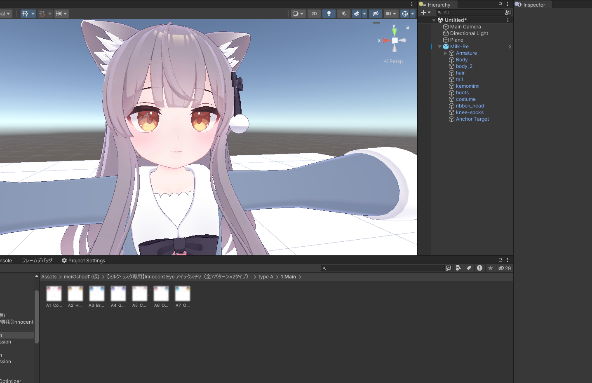

# 専用テクスチャーを導入する

専用テクスチャー を導入するのに、マテリアル 破壊的に変更したうえ テクスチャーメモリ をわざわざ二倍にするんですか ... ?

え？だからって ペイントツール 開くの ... ? 開いてテクスチャを適用した PNG に書き出して、 マテリアル を破壊的に変更して割り当てないといけないんですか ... ?

一枚の 専用テクスチャー を導入したいだけなのに ... ?

でも TexTransTool を使えば、非破壊かつ Unity 内で 専用テクスチャー を導入できます！ ペイントツールを開く必要も、マテリアルを破壊する必要もない！

## チュートリアル

このチュートリアルでは [あまとうさぎ/Milk-Re](https://komado.booth.pm/items/2953391) に、[meiのshop❣ (仮)/Innocent Eye](https://mei18.booth.pm/items/5055441) を TexTransTool の機能を使って導入します。

初めに、導入したい 3Dモデル と、 専用テクスチャー(PNG) を Unity にインポートしましょう。

専用テクスチャー を適用したい アバター(3Dモデル) を Scene に置き、 Project から 専用テクスチャー にアクセスできる状態であれば次に進みましょう！  

次はアバターに適用するために必要な TexTransTool のコンポーネントを生成する必要があります

アバター の ルート を右クリックから、 `TexTransTool/TTT TextureBlender` をクリック！

このような空っぽの `TTT TextureBlender` が表示されていれば次に進みましょう。  

次に 導入する専用テクスチャー に応じた テクスチャー を選択しましょう！  
このチュートリアルで導入数テクスチャーは Eyeテクスチャー なので 顔のテクスチャー を選択します。  

:::info
このチュートリアルの画像は、開発中の TexTransTool の物で、一部表示が英語の物があります。
:::

選択したら真っ白になっていることでしょう、この状態になっていれば正常なので次に進みます。

最後の手順です！ `ブレンドテクスチャー` に導入したい テクスチャー を割り当てます。  
Eyeテクスチャー には カラーバリエーション があることが多いでしょう、お好みの物を割り当てましょう！  

[Innocent Eye](https://mei18.booth.pm/items/5055441) の `A3_BrightBlue` を割りあててみました。いい感じですね！  

このままアップロードすれば、VRChat でも 専用テクスチャーが導入されていることが確認できます！

:::tip
TexTransTool は非破壊なツールのなので、新しく生成した GameObject `TextureBlender` を無効化したり、削除すれば導入した専用テクスチャをいつでも外すことができます！
:::

## クレジット

ミルク Re -Milk Re-【オリジナル3Dモデル】: https://komado.booth.pm/items/2953391

【ミルク・ラスク専用】Innocent Eye アイテクスチャ（全7パターン×2タイプ）: https://mei18.booth.pm/items/5055441
