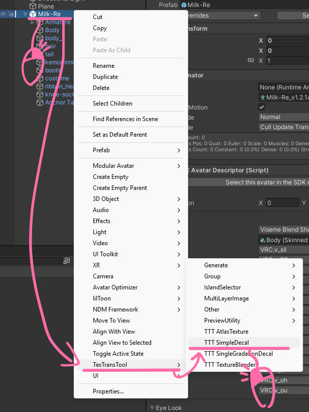
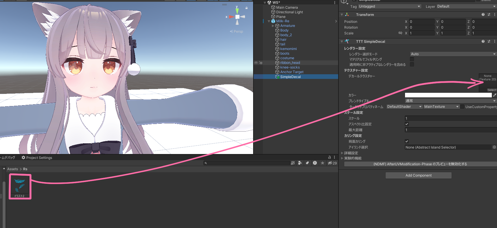
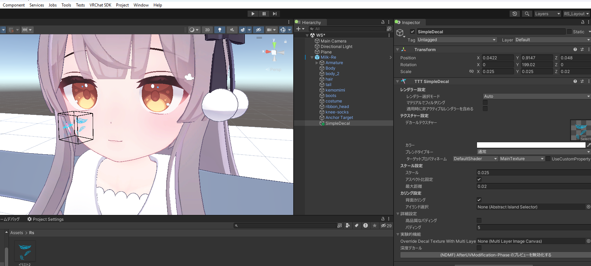
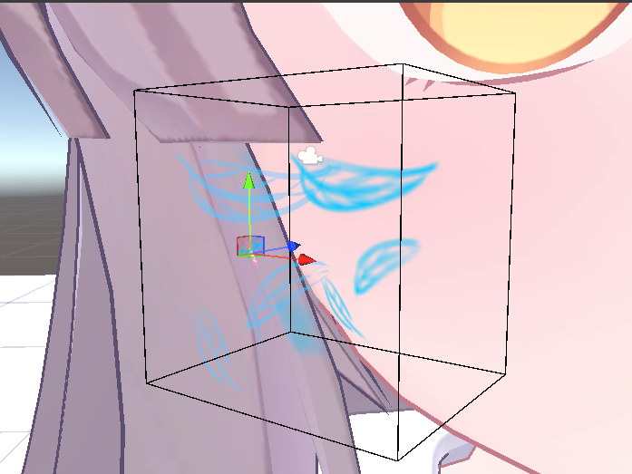
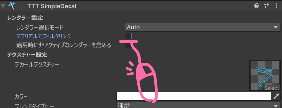
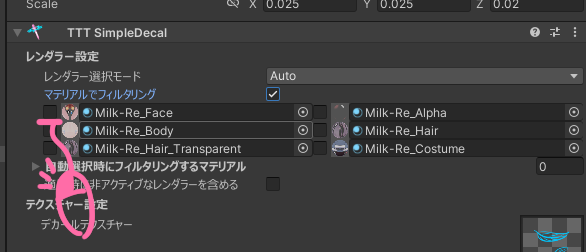
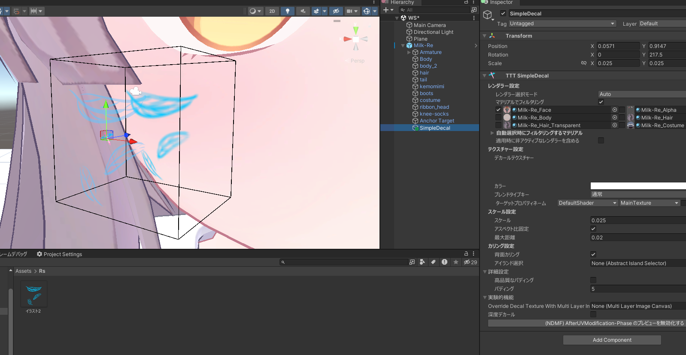

# シンプルなデカールを貼り付ける

アバターに デカール を追加しようとするなら、 UV を理解して外部ツールで適用する必要があったり、物によっては UV の境目を超えることができなかったりします。

でも！ SimpleDecal を使えば  Unity 内で、 UV を理解しなくても直感的に、そして UV の境界を超越して デカール を追加できるよ！

## チュートリアル

はじめに、アバターのルートを右クリックしてから、`TexTransTool/TTT SimpleDecal` を選択！  

貼り付けたい デカール のテクスチャを `デカールテクスチャー` に割り当てたら  

次は、デカールを貼りたい場所や、角度の調整を行い、`スケール設定` から `スケール` や `最大距離` を操作して調整します。

たとえば...ほっぺに模様を張るときだったらこんな感じ！

:::note
ギズモが表示されないときは、[ここ](/docs/FAQ#ギズモが表示されない)をご参照ください。
:::

問題がなければ そのまま アバターをアップロードしてしまっても良いですが、場所によってはデカールを追加したくない場所に、追加されてしまうことがあります。  

そんな時は `マテリアルでフィルタリング` や `アイランドセレクター` 等を用いて デカールが追加される範囲を制限する必要があります！

今回は `マテリアルでフィルタリング` を使ってみましょう。

有効化して、今回は肌の方にだけ追加したいので Face マテリアルを選択します。  

肌の方にだけ追加されていい感じですね！

このままアップロードすれば VRChat でも デカールが追加されていることが確認できると思います！

## クレジット

- あまとうさぎ/Milk Re : https://booth.pm/ja/items/2953391
