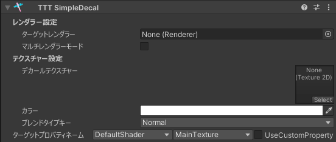
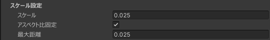

# シンプルなデカールを貼り付ける

アバターに少しワンポイント、テクスチャを追加しようとするなら UV を理解して頑張ったりする必要があったり、外部ツールが必要になったりします。

でも！ SimpleDecal を使えば UV を理解しなくても直感的に、テクスチャに柄や模様を非破壊で簡単にできます！

## チュートリアル

はじめに、アバターのルートを右クリックしてから、TexTransTool/TTT SimpleDecal を選択！  

そしたら、レンダラー設定のターゲットレンダラーにデカールを張りたいレンダラー(メッシュ)を、  
そしてデカールテクスチャーにそれらレンダラーに張り付けたい柄や模様のテクスチャーを設定したら  

次は、デカールを貼りたい場所や、角度の調整を行い、 大きさや奥行きは下記画像を参考にスケールと最大距離を操作して調整します。  

たとえば...ほっぺに模様を張るときだったらこんな感じ！

:::note
ギズモが表示されないときは、[ここ](/docs/FAQ#ギズモが表示されない)をご参照ください。
:::

これで設定は終わり、アップロード時に自動で適用されます！

## クレジット

- あまとうさぎ/Milk Re : https://booth.pm/ja/items/2953391
