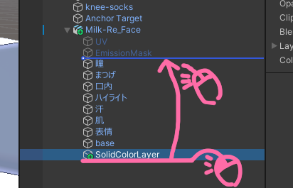
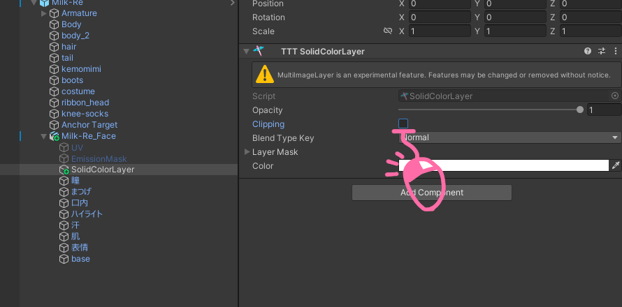

# TTT PSD Importer のチュートリアル

Photoshop や Clip Studio Paint を持ってないけど、色改変したい！

なら [GIMP](https://www.gimp.org/) や [Krita](https://krita.org/) でも使う? ...それらのソフトだと PSD が正しく読めないって?  
別におかしなことじゃない、それらソフトは PSD を扱うことを目的としているわけじゃないのだから、そもそもお門違いな話だ！

そもそも PSD に互換性なんてない、Photoshop と Clip Studio Paint がほかに比べて近いから何とかなってるだけにすぎないんだよ。  
それでもね... PSD に互換性がなかったとしてもね...そのソフトウェアに対して、 __できるだけ互換性のある実装__ を作ることはできる。

それが、 [TexTransTool PSD Importer](/docs/Reference/TexTransToolPSDImporter) と [MultiLayerImageCanvas](/docs/Reference/MultiLayerImageCanvas)！  
これらを使えば Photoshop か Clip Studio Paint から出力された PSD をメジャーな範囲であれば高い再現度で扱うことができるんだ！  

## チュートリアル

:::warning
TTT PSD Importer と MultiLayerImageCanvas は実験的なコンポーネントです！予告なく機能変更や削除がされる可能性があります。
:::

初めに！ PSD が無いと始まりませんね  
アバターなどのファイルから PSD を Drag & Drop しましょう！  

次！ Unity にインポートされた PSD から 改変したいテクスチャを 一つまたは複数個 選択して、  
インスペクター上部の `Imporoter` から `net.rs64.TexTransTool.MultiLayerImage.Importer.TexTransToolPSDImporter` を選択！

しばらくしたら、PSD が画像から Prefab になります。  

そしたら、インポートした PSD をアバターに適用してみましょう！　　
まずは、アバターにそのプレハブを Drag & Drop！  

次にそのプレハブのルートを選択し、 [TTT MultiLayerImageCanvas](/docs/Reference/MultiLayerImageCanvas) の `OpenSelector` から適切なテクスチャーを選択しましょう！  

選択したら...おっと UV が表示されています。  
物によって最初から表示されたりされなかったりしますが、適用できていることがか確認できますね！  

こっからは、PSD からインポートされた [TTT MultiLayerImageCanvas](/docs/Reference/MultiLayerImageCanvas) の改変チュートリアルです！

## MultiLayerImageCanvas のチュートリアル

はじめに、UV がデフォルトで表示さているような PSD は UV を無効化する必要があります！

UV のレイヤーを探して無効化しましょう！`Milk_Re_Face` の場合ならこれ！  
そしたらその GameObject を無効化！ GameObject の IsActive がそのままレイヤーの有効化・無効化の状態になります！  

UV が消えてきれいになりましたね！

では...本命の色改変となるわけですが、今回は目の色の改変をしてみましょう！

まずは、改変したい対象の レイヤー または レイヤーフォルダー を探しましょう！  
目の色なので、`瞳`レイヤーですね！  

色の変更方法もいくつか存在しますが、今回はべた塗レイヤーとクリッピングを使いましょう！  
対象のレイヤーの親となる GameObject を選択し、右クリックから TexTransTool/MultiLayerImageCanvas/TTT SolidColorLayer を選択！  

生成できたら、SolidColorLayer を今回の場合 `瞳`レイヤーの上に移動させましょう！  

あら...真っ白になっちゃいました、フォルダーの階層が深い PSD なら一部だけ真っ白になってる場合もあるかもしれませんね！  

ここままではよくないので、下のレイヤーの範囲にだけ影響するようになる、クリッピングを有効にしましょう！  
レイヤーの `Clipping` を有効化するとクリッピングが有効になります！  

瞳だけが真っ白になりましたね！いい感じ！  

でも...真っ白にしたいわけではないので、まずは色を決めましょう！  
SolidColorLayer の `Color` を左クリックし、カラーピッカーを表示してお好みの色を選びましょう！  

次に、合成モードである `BlendTypeKey` を適当なものに設定しましょう！  
どれが良いかは適当に試しましょう...元のテクスチャの色や目標としている色によって目標に近くなる合成モードは変わります。  
なので、べた塗レイヤーの色、さらには透明度(`Opacity`)などとも合わせて調整しましょう！  

例えば...こんな感じ！

べた塗レイヤー一つではいい色にならない場合もあると思います。  
そういった時はほかの色調補正レイヤーである、色相・彩度([HSLAdjustmentLayer](/docs/Reference/MultiLayerImageCanvas/HSLAdjustmentLayer)) レベル補正 ([LevelAdjustmentLayer](/docs/Reference/MultiLayerImageCanvas/LevelAdjustmentLayer)) なども試してみてください！

これで、このチュートリアルは終わりです！

最後に！これらのテクスチャ改変は アバターのプレハブバリアントを作るのと同じように バリアントにすることもできます。  
非常に面白いので使ってみてください！

## クレジット

- あまとうさぎ/Milk Re : https://booth.pm/ja/items/2953391
