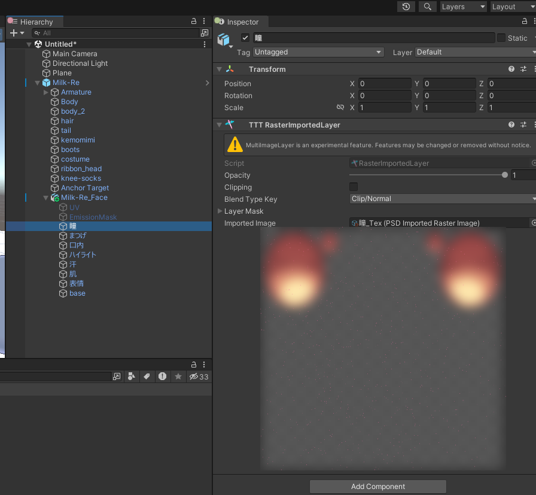
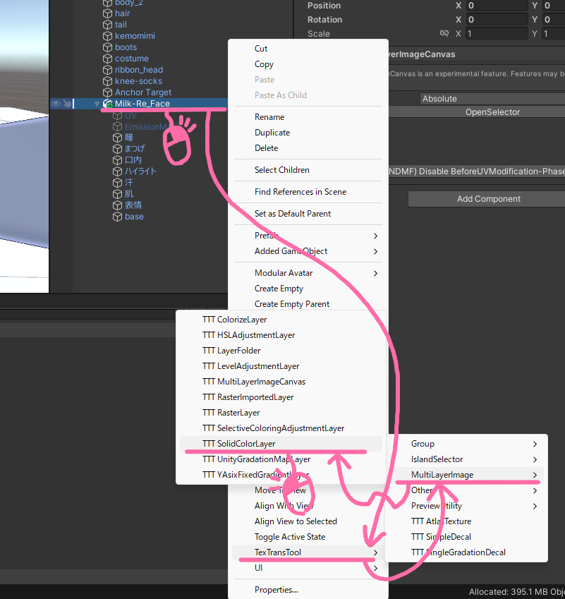
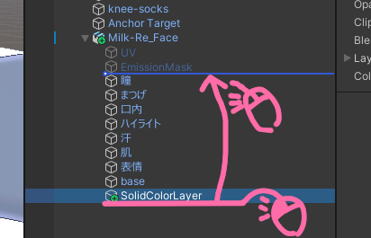
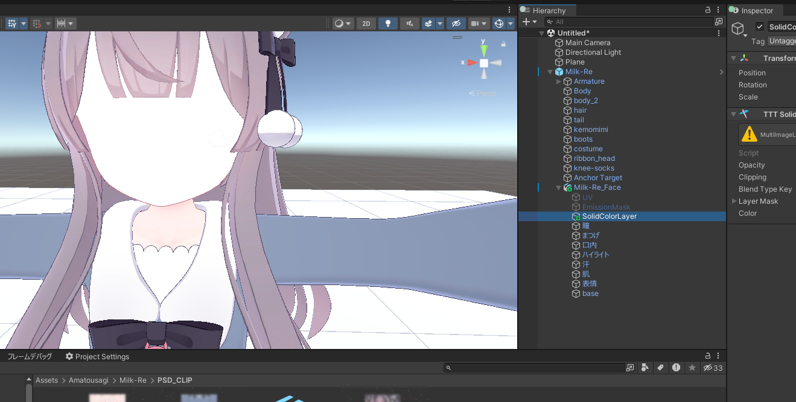
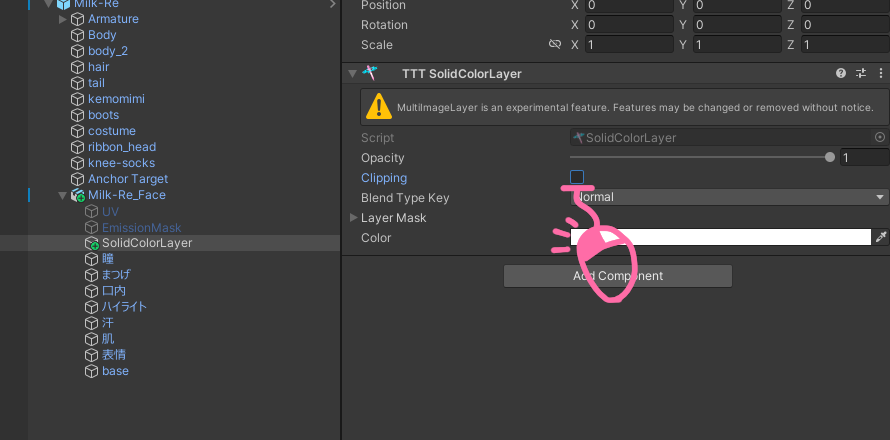
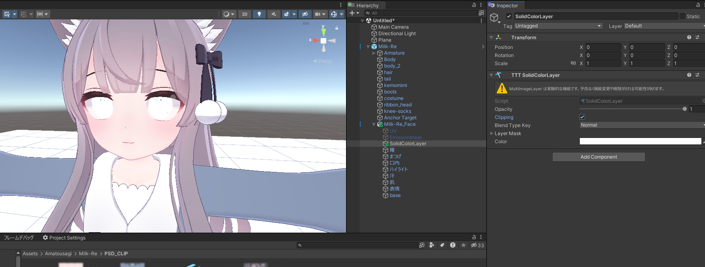
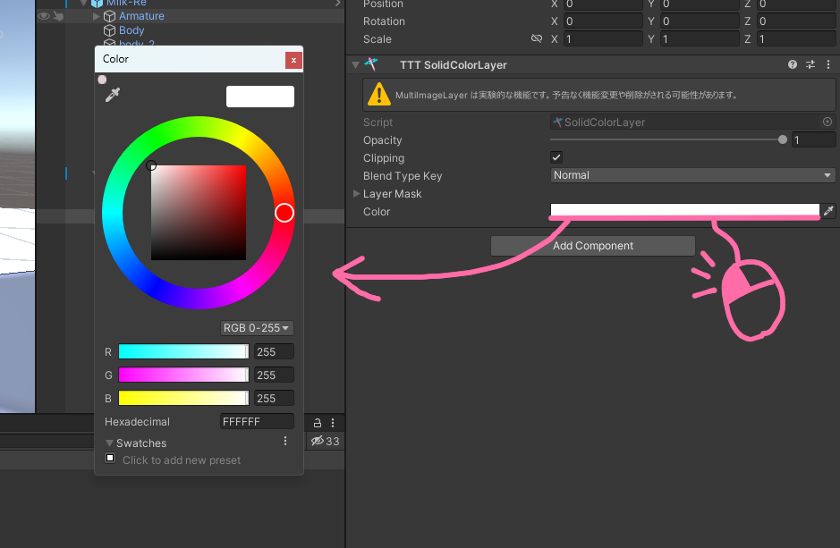
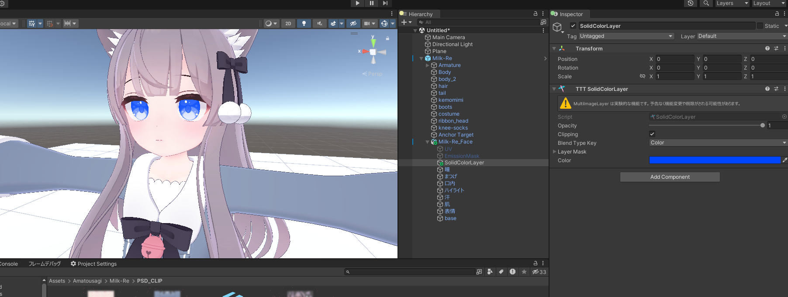

# 単純な色改変

このチュートリアルでは、この アバターに割り当てた PSD(MultiLayerImageCanvas) を使って、目の色を改変してみましょう！

## チュートリアル

まずは、改変したい対象の レイヤー または レイヤーフォルダー を探しましょう！  
目の色なので、`瞳`レイヤーですね！  

色の変更方法もいくつか存在しますが、今回はべた塗レイヤーとクリッピングを使いましょう！  
対象のレイヤーの親となる GameObject を選択し、右クリックから TexTransTool/MultiLayerImageCanvas/TTT SolidColorLayer を選択！  

生成できたら、SolidColorLayer を今回の場合 `瞳`レイヤーの上に移動させましょう！  

あら...真っ白になっちゃいました、フォルダーの階層が深い PSD なら一部だけ真っ白になってる場合もあるかもしれませんね！  

ここままではよくないので、下のレイヤーの範囲にだけ影響するようになる、クリッピングを有効にしましょう！  
レイヤーの `Clipping` を有効化するとクリッピングが有効になります！  

瞳だけが真っ白になりましたね！いい感じ！  

でも...真っ白にしたいわけではないので、まずは色を決めましょう！  
SolidColorLayer の `Color` を左クリックし、カラーピッカーを表示してお好みの色を選びましょう！  

次に、合成モードである `BlendTypeKey` を適当なものに設定しましょう！  
どれが良いかは適当に試しましょう...元のテクスチャの色や目標としている色によって目標に近くなる合成モードは変わります。  
なので、べた塗レイヤーの色、さらには透明度(`Opacity`)などとも合わせて調整しましょう！  

例えば...こんな感じ！

べた塗レイヤー一つではいい色にならない場合もあると思います。  
そういった時はほかの色調補正レイヤーである、色相・彩度([HSLAdjustmentLayer](/docs/Reference/MultiLayerImageCanvas/HSLAdjustmentLayer)) レベル補正 ([LevelAdjustmentLayer](/docs/Reference/MultiLayerImageCanvas/LevelAdjustmentLayer)) なども試してみてください！

これで、このチュートリアルは終わりです！

最後に！これらのテクスチャ改変は アバターのプレハブバリアントを作るのと同じように バリアントにすることもできます。  
非常に面白いので使ってみてください！

## クレジット

- あまとうさぎ/Milk Re : https://booth.pm/ja/items/2953391
