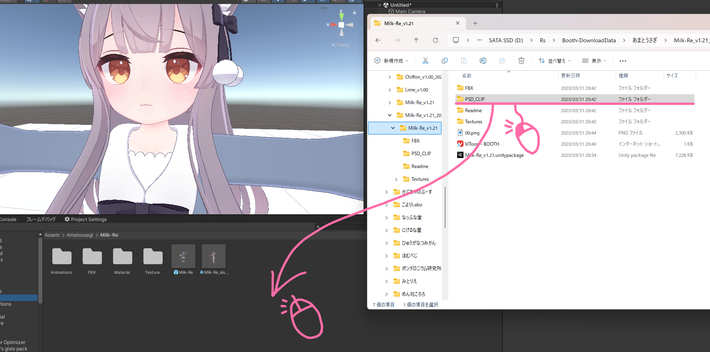
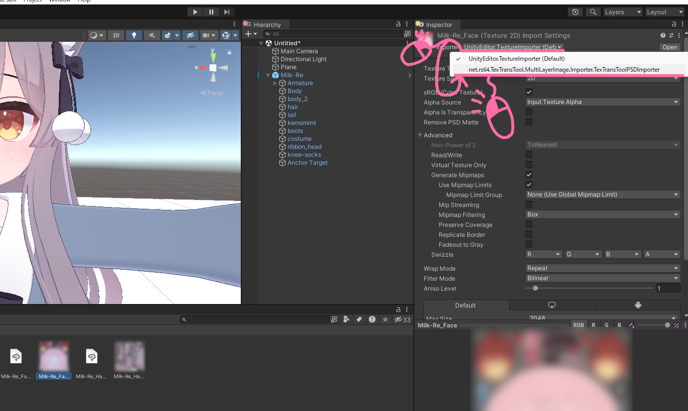
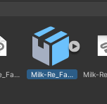
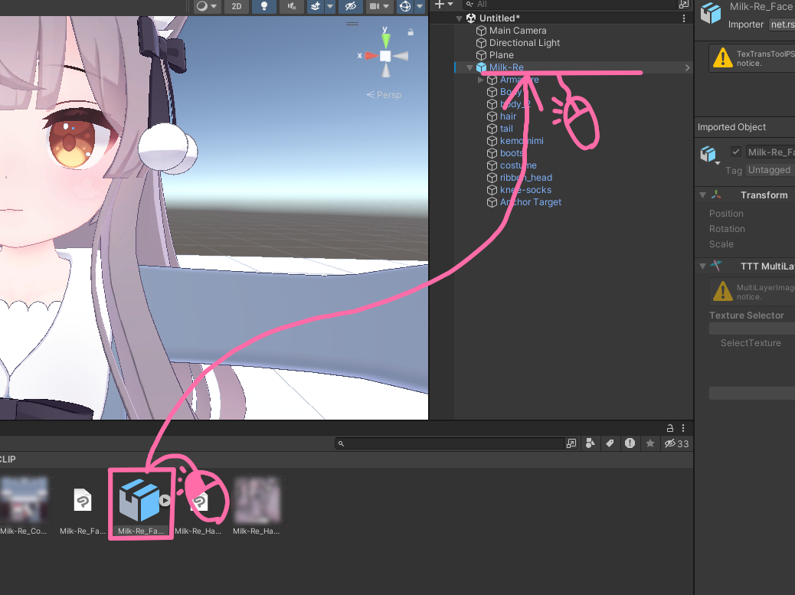
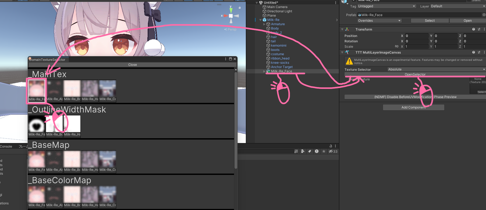
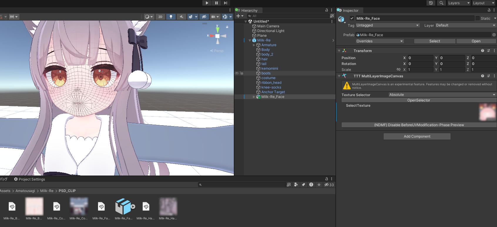
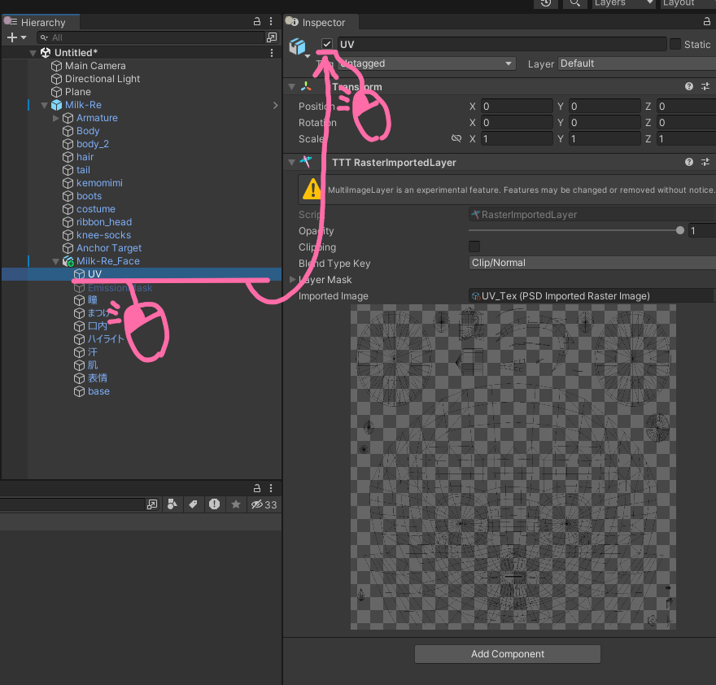
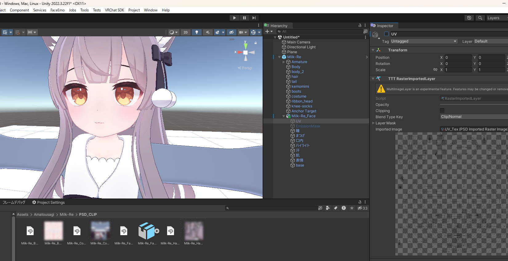

# PSDを使ってテクスチャ改変をする

:::warning
TTT PSD Importer と MultiLayerImageCanvas は実験的なコンポーネントです！予告なく機能変更や削除がされる可能性があります。
:::

Photoshop や Clip Studio Paint を持ってないけど、テクスチャ改変がしたい！

なら [GIMP](https://www.gimp.org/) や [Krita](https://krita.org/) でも使う? ...それらのソフトだと PSD が正しく読めないって?  
当然のことながら、それらソフトは PSD を扱うことを目的としているわけじゃないのだからそもそもお門違いな話だよ！

そもそもペイントソフト間に互換性を作ることなど不可能、 Photoshop と Clip Studio Paint がほかに比べて近いから何とかなってるだけにすぎないんだ...  
それでもね、ペイントソフト間に互換性がなかったとしても、そのソフトウェアに対して、 __できるだけ互換性のある実装__ を作ることはできる。

それが、 [TexTransTool PSD Importer](/docs/Reference/TexTransToolPSDImporter) と [MultiLayerImageCanvas](/docs/Reference/MultiLayerImageCanvas)  
これらを使えば Photoshop か Clip Studio Paint から出力された PSD をメジャーな範囲であれば高い再現度で扱うことができるんだ！  

## 共通のチュートリアル

初めに、アバターに無改変の PSD を割り当てる必要があります！

まず PSD が無いと始まりません。アバターなどのファイルから PSD を Drag & Drop しましょう！  

次！ Unity にインポートされた PSD から 改変したいテクスチャを 一つまたは複数個 選択して、  
インスペクター上部の `Imporoter` から `net.rs64.TexTransTool.MultiLayerImage.Importer.TexTransToolPSDImporter` を選択！

しばらくしたら、PSD が画像から Prefab になります。  

そしたら、インポートした PSD をアバターに適用してみましょう！  
まずは、アバターにそのプレハブを Drag & Drop！  

次にそのプレハブのルートを選択し、 [TTT MultiLayerImageCanvas](/docs/Reference/MultiLayerImageCanvas) の `OpenSelector` から適切なテクスチャーを選択しましょう！  

選択したら...おっと UV が表示されています。  
物によって最初から表示されたりされなかったりしますが、適用できていることがか確認できますね！  

その UV のレイヤーを探して無効化しましょう！`Milk_Re_Face` の場合ならこれ！  
そしたらその GameObject を無効化！ GameObject の IsActive がそのままレイヤーの有効化・無効化の状態になります！  

UV が消えてきれいになりましたね！

では...本命の色改変となるわけですが、この PSD を使って行える色改変はいくつかあるので、目的に近いものを見ていってくださいね！

## チュートリアル一覧

[__単純な色改変__](/docs/Tutorial/TextureModificationByPSD/ColorModification)

## クレジット

- あまとうさぎ/Milk Re : https://booth.pm/ja/items/2953391
