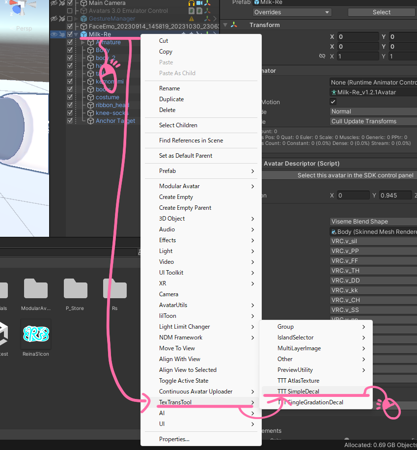
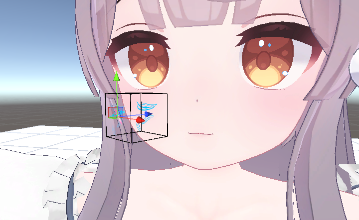
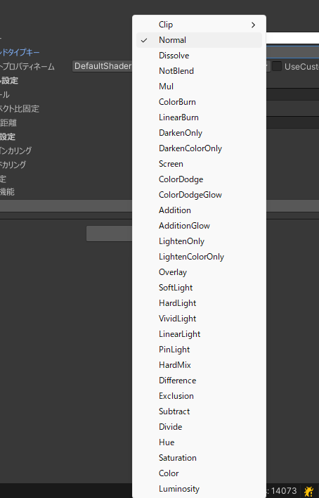

# SimpleDecal Tutorial

Even if it just change the color a little, change everything with Material, or work hard with external tools…
The former does not allow for fine-tuning, and the latter requires an understanding of UV.

But! with SimpleDecal, can intuitively without understanding UV,
It is a non-destructive and easy way to patterns, designs and even hair meshes to bake to texture!

## Tutorial

First, Right click to avatar root next left click to "TexTransTool/TTT SimpleDecal"!

Then, in the TargetRenderer on RendererSetting, select the Renderer(mesh) want to apply the decal,  
and set the pattern texture you want to apply to that renderer to DecalTexture.  

Next!、operate and adjust where to want place the decal, and angle, and adjust the size and depth by manipulating reference the Scale and MaxDistance in the example image.  

For example...if where to add a pattern on cheek, it would look like this!

The settings now complete, auto apply when upload!

## Tutorial for adding Gradient

SimpleDecal is not just a tool for "intuitively pasting textures".

This tutorial is a special use case for adding gradients to hair!

premise of fully understand the above tutorial.

Prepare an appropriate gradation texture, that is set to SimpleDecal, adjustment position and rotation!  
If Milk's bangs, place it like the example image.

Next, disable SideCulling(back culling setting) to apply the gradient to all polygons within range.

After settings maybe it looks like the image!

See beautiful gradation! ... but may want to a differently color blending!
In such cases, the TexTransTool is available for over 30 standard color blends by changing the BlendTypeKey!

There are so many! Use the one that looks good!

That tutorial over. one final, this tutorial is used a blue gradient, but if use a white gradient image, can change tha color on the spot from the Color and use it!  

## Credit

- あまとうさぎ/Milk Re : https://booth.pm/ja/items/2953391
